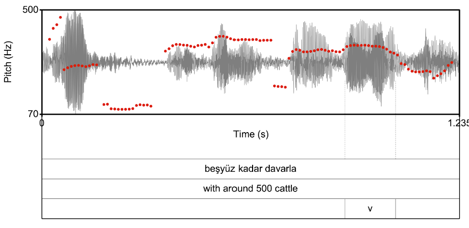

title: 'Intonation of Greek in contact with Turkish: a corpus-based diachronic study'
author: "Mary Baltazani, Joanna Przedlacka, Özlem Ünal, Pavel Logačev, John Coleman"
date: '2022-07-18'
output: html_document


```{r setup, include=FALSE}
knitr::opts_chunk$set(echo = TRUE)
```

```{r echo=FALSE, warning=FALSE, message=FALSE}
library(knitr)

opts_chunk$set(cache=F)
```


```{r global_packages, echo=TRUE, results='hide', echo=FALSE}
#library(tidyverse) # data manipulation
library(dplyr) # data manipulation
options(dplyr.summarise.inform = FALSE)

library(magrittr) # pipes (%>% / %<>%)
library(readr) # for read_csv(), read_delim()

#library(cmdstanr) # R interface to Stan (mc-stan.org, for statistical modeling) [an alternative is 'rstan']
library(brms) # lme4-like interface to Stan
#options(brms.backend = "cmdstanr")

library(ggplot2) # plotting
library(plotly) # sharper plots in html
theme_set(theme_bw() + theme(legend.position="top"))

#library(rethinking)
```

```{r echo=FALSE}
df_amg <- readRDS("../data/data_mix.rds")

df_amg %<>% ungroup() %>%
                dplyr::mutate( median_Turkish = median(tau [dialect=="Turkish"]),
                               median_Athenian = median(tau [dialect=="Athenian"]) )
df_amg %<>% dplyr::mutate( median_Turkish = ifelse(dialect=="Athenian", NA, median_Turkish),
                               median_Athenian = ifelse(dialect=="Turkish", NA, median_Athenian) )

color_AMG <- "gray"
color_turkey <- "#E30A17"
color_greece <- "#0D5EAF"

df_contr_dialect <- data.frame(dialect = c('Athenian', 'AMG', 'Turkish'),
                               cDialect_AMGmATH = c(-2/3,   1/3,  1/3),
                               cDialect_TRmAMG  = c(-1/3,  -1/3,  2/3)
                               )
df_amg %<>% left_join( df_contr_dialect , by = "dialect")


df_contr_generation <- data.frame(generation = c("generation 1", "generation 2", "generation 3", "generation 4"),
                                  cGen_2m1 = c(-3/4,  1/4,  1/4,  1/4),
                                  cGen_3m2 = c(-2/4, -2/4,  2/4,  2/4),
                                  cGen_4m3 = c(-1/4, -1/4, -1/4,  3/4))
df_amg %<>% left_join( df_contr_generation )


# set group ids for Athenian (-1), AMG (0), Turkish (1) to be used in the mixture analysis 
dialect_id <- data.frame(dialect = c('Athenian','AMG','Turkish'), dialect_id=c(-1, 0, 1))
df_amg %<>% left_join(dialect_id)
```

# Mixture Model | Background

- Baltazani, Przedlacka, Ünal, Logačev & Coleman (under review). Intonation of Greek in contact with Turkish: a corpus-based diachronic study.

- Speakers of Asia Minor Greek (AMG) was in close contact with Turkish until a two-way mass migration in the early 1920s.

- Still spoken by communities in Greece.

- How long do contact effects in intonation persist after contact has ceased?

- We extracted $f_0$ patterns from speech corpora for AMG, Greek, and Turkish and annotated $f_0$ shape curves.


# Mixture Model | Background

- Example $f_0$ contour for a Turkish sentence. (Octave errors were corrected.)

- We will focus on single parameter for this workshop, the *L tone alignment* $\tau$, which reflects the distance between the local minimum of the $f_0$ curve and the last stressed vowel in the utterance.

- $\tau$ tends to be $0$ in Athenian and *positive* in Turkish. 




# Mixture Model | Data

- Distribution of $\tau$ for each utterance by dialect and generation. Dotted lines indicate medians of the Turkish and Athenian distributions.

- The early AMG distributions looks quite bimodal, and appears to become more unimodal*-ish* with time.

- But the peaks aren't **quite** where they are supposed to be. 

- Can we quantify that intuition?


```{r echo=FALSE, warning=FALSE, message=FALSE}


plot_histogram <- function(parameter) {
     df_amg %>% ggplot(aes_string( parameter )) + 
                geom_histogram(aes( y = ..density.., fill = dialect)) +
                scale_fill_manual(values = c(color_AMG, color_greece, color_turkey)) +
                #geom_vline(aes(xintercept = median_Turkish), color = color_turkey, linetype = "dashed") +
                #geom_vline(aes(xintercept = median_Athenian), color = color_greece, linetype = "dashed") +
                facet_grid(dialect ~ generation, scales = "free_y") +
                scale_y_continuous("percentage of observations", labels=scales::percent) +
                # scale_x_continuous("L tone alignment (𝝉)") + 
                theme(strip.background =element_rect(fill="white")) 
}

lapply(c("tau", "c1", "c2", "c3", "c4"), function(par) plot_histogram(par))


```


# Mixture Model | Hypothesis

- AMG speakers' utterances are either Athenian-like or Turkish-like. 

- The mixture proportion changes from generation to genderation. 

- Not all mixtures look equally bimodal: Shapes of hypothetical mixture distibutions as a function of mixture proportion $\lambda$ and distance between component modes.


```{r echo=FALSE}

{
plot_mixture <- function(lambda, mu1, mu2, sigma1, sigma2)
{
    limts_scale = 3
    
    fn1 <- function(x) lambda*dnorm(x, mean = mu1, sd = sigma1)
    fn2 <- function(x) (1-lambda)*dnorm(x, mean = mu2, sd = sigma2)
    
    p <- ggplot()
    p <- p + stat_function(fun = function(x) fn1(x) + fn2(x))
    p <- p + stat_function(fun = function(x) fn1(x), linetype = "dashed") # , color = "darkgrey"
    p <- p + stat_function(fun = function(x) fn2(x), linetype = "dotted") #, color = "darkgrey"
    # limits <- c(mu1+limts_scale*c(1,-1)*sd1, mu2+limts_scale*c(1,-1)*sd2) %>% range()
    # p + scale_x_continuous(limits = limits) +
    p + ylab("probability density") + theme_bw() + scale_y_continuous(breaks=NULL)
}

p1 <- plot_mixture(lambda=.3, mu1=-4, mu2=0, sigma1=1, sigma2=1) + scale_x_continuous(limits = c(-8, 3), breaks=NULL) 
p2 <- plot_mixture(lambda=.5, mu1=-4, mu2=0, sigma1=1, sigma2=1) + scale_x_continuous(limits = c(-8, 3), breaks=NULL)
p3 <- plot_mixture(lambda=.7, mu1=-4, mu2=0, sigma1=1, sigma2=1) + scale_x_continuous(limits = c(-8, 3), breaks=NULL)

p4 <- plot_mixture(lambda=.3, mu1=-2.5, mu2=0, sigma1=1, sigma2=1) + scale_x_continuous(limits = c(-8, 3), breaks=NULL)
p5 <- plot_mixture(lambda=.5, mu1=-2.5, mu2=0, sigma1=1, sigma2=1) + scale_x_continuous(limits = c(-8, 3), breaks=NULL)
p6 <- plot_mixture(lambda=.7, mu1=-2.5, mu2=0, sigma1=1, sigma2=1) + scale_x_continuous(limits = c(-8, 3), breaks=NULL)

}

library(ggpubr)

strip_background <- theme(strip.background = element_rect(fill= "#d3d3d3"))

p <-
ggpubr::ggarrange(p1 + strip_background + facet_grid(~"lambda = 0.25"),
                  p2 + strip_background + facet_grid(~"lambda = 0.5"),
                  p3 + strip_background + facet_grid("distance = 4*SD"~"lambda = 0.75"), 
                  p4 + strip_background + facet_grid(~"lambda = 0.25"), 
                  p5 + strip_background + facet_grid(~"lambda = 0.5"), 
                  p6 + strip_background + facet_grid("distance = 2.5*SD"~"lambda = 0.75"), 
                  labels = LETTERS[1:6],
                  widths = rep(c(.8, .8, .9), 2))

print(p)

```


# Mixture Model | Model Specification

The simple part:

- Each Athenian utterance $i$ for speaker $s$ comes from a normal distribution. 

$$\tau_{s,i} \sim N(\mu_{A_s}, \sigma_{A})\text{, where }\mu_{A_s} = \mu_{A} + \Delta\mu_{s}$$


- Each Turkish utterance $i$ for speaker $s$ comes from a normal distribution.

$$\tau_{s,i} \sim N(\mu_{T_s}, \sigma_{T})\text{, where }\mu_{T_s} = \mu_{T} + \Delta\mu_{s}$$


# Mixture Model | Model Specification

The interesting part:

- Each speaker $s$ of AMG has a Turkish-like register and an Athenian-like register in AMG.

- Each AMG utterance $i$ for speaker $s$ comes from a mixture distribution:

$$z ~ \sim Bernoulli(\lambda_G)$$
$$y_{S}|z=0 \sim N(\mu_{T_S}, \sigma_{T})$$
$$y_{S}|z=1 \sim N(\mu_{A_S}, \sigma_{A})$$

- Each AMG speaker's deviation from the register average is the same for both registers 

$$\mu_{T_s} - \mu_{T} = \mu_{A_s} - \mu_{A} =  \Delta\mu_{s}$$

- The mixture weight $\lambda$ varies by generation: $\lambda_1$, $\lambda_2$, $\lambda_3$, $\lambda_4$.


# Mixture Model | Model Structure

- This specification requires a custom distribution for `brms` which we can define in Stan in three steps.
  1. Define a likelihood function.
  2. Declare it as a distribution.
  3. Use it in brms.

# Custom Gaussian Mixture Distribution

```{r warning=FALSE, message=FALSE, size="small"}
stanvar_fn <- stanvar(block = "functions", scode = "
real shifted_gaussian_mixture_lpdf(real x, 
                                   real mu1, real mu2, 
                                   real sigma1, real sigma2, 
                                   real theta, real shift, 
                                   real group)
{
      real log_lik;
      real shifted_mu1 = mu1 + shift;
      real shifted_mu2 = mu2 + shift;
  
      if (group == -1) {
        log_lik = normal_lpdf(x|shifted_mu1, sigma1);
  
      } else if (group == 1) {
        log_lik = normal_lpdf(x|shifted_mu2, sigma2);
  
      } else if (group == 0) {
        log_lik = log_mix(inv_logit(theta),
                            normal_lpdf(x|shifted_mu1, sigma1),
                            normal_lpdf(x|shifted_mu2, sigma2)
                        );
  
      }
      
      return log_lik;
}")

```

```{r warning=FALSE, message=FALSE, size="small"}
shifted_gaussian_mixture <- custom_family(
  name = "shifted_gaussian_mixture", 
  dpars = c("mu","muAlt", "sigma", "sigmaAlt", "lambda", "shift"),
  links = c("identity","identity", "log", "log", "logit", "identity"),
  lb = c(NA,NA,0,0,0,NA), 
  ub = c(NA,NA,NA,NA,1,NA),
  type = "real",
  vars = c("vreal1[n]")
)
shifted_gaussian_mixture$dpars <- c("mu", "mu2", "sigma1", "sigma2", "lambda", "shift")

```


# Model Comparison Functions

```{r warning=FALSE, message=FALSE, size="small"}

compute_loo <- function(fit) {
  if (is.null(fit$criteria$loo)) 
  {
      brms::expose_functions(fit, vectorize = T)
      fit <- brms::add_criterion(fit, "loo")
  }
  fit
}

eq_dim <- function(a, b) {
  ( length(dim(a)) == length(dim(b)) ) & ( dim(a) == dim(b) ) 
}

extract_cols <- function(i, par)
{
  if (length(dim(par)) == 0) {
    # nothing to change (par <- par)
    
  } else if (length(dim(par)) == 2) {
    par <- par[,i]
    
  } else {
    stop("Invalid number of dimensions")
  }
  par
}


log_lik_shifted_gaussian_mixture <- function(i, prep)
{
  stopifnot( eq_dim(prep$dpars$mu, prep$dpars$mu2) &
             eq_dim(prep$dpars$mu2, prep$dpars$sigma1) &
             eq_dim(prep$dpars$sigma1, prep$dpars$sigma2) &
             eq_dim(prep$dpars$sigma2, prep$dpars$lambda) &
             eq_dim(prep$dpars$lambda, prep$dpars$shift)
            )

  mu1 <- extract_cols(i, prep$dpars$mu)
  mu2 <- extract_cols(i, prep$dpars$mu2)

  sigma1 <- extract_cols(i, prep$dpars$sigma1)
  sigma2 <- extract_cols(i, prep$dpars$sigma2)

  lambda <- extract_cols(i, prep$dpars$lambda)
  shift <- extract_cols(i, prep$dpars$shift)

  y <- prep$data$Y[i]
  group <- prep$data$vreal1[i]

  shifted_gaussian_mixture_lpdf(y, mu1, mu2, sigma1, sigma2, lambda, shift, group)
}

```


# Mixture Model Formula and Priors

```{r warning=FALSE, message=FALSE, size="small"}

# set up the model formula
formula_mix <- bf( dv|vreal(dialect_id) ~ 1, 
                   mu2 ~ 1,
                   sigma1 ~ 1,
                   sigma2 ~ 1,
                   lambda ~ 1 + cGen_2m1 + cGen_3m2 + cGen_4m3, 
                   shift ~ 0 + (1|speaker)
                  )

```

```{r warning=FALSE, message=FALSE, size="small"}

prior_mu = 'normal(0, 5)'
prior_sigma = 'normal(1, 5)'
prior_lambda = 'normal(0,2)'
prior_delta_lambda = 'normal(0,2)'

priors_mix <- c(
    set_prior(              class = 'Intercept', prior = prior_mu),
    set_prior(dpar = 'mu2', class = 'Intercept', prior = prior_mu),
    
    set_prior(dpar  = 'sigma1', class = 'Intercept', prior = prior_sigma),
    set_prior(dpar  = 'sigma2', class = 'Intercept', prior = prior_sigma),
    
    set_prior(dpar = 'lambda', class = 'Intercept', prior=prior_lambda),
    set_prior(dpar = 'lambda', class = 'b', prior=prior_delta_lambda)
)


```

# Baseline Model Formula and Priors

```{r warning=FALSE, message=FALSE, size="small"}

# set up the model formula
formula_baseline <- bf(dv ~ (cGen_2m1 + cGen_3m2 + cGen_4m3)*(cDialect_AMGmATH + cDialect_TRmAMG) + (1|speaker))

```

```{r warning=FALSE, message=FALSE, size="small"}

prior_avg_mu = 'normal(0, 5)'
prior_delta_mu = 'normal(0, 5)'
prior_sigma = 'normal(1, 5)'

priors_baseline <- c(
    set_prior(class = 'Intercept', prior = prior_avg_mu),
    set_prior(class = 'b', prior = prior_delta_mu),
    set_prior(class = 'sigma', prior = prior_sigma))


```


# Fit Both Models

```{r warning=FALSE, message=FALSE, size="small"}

n_cores = 2

dvs = c("c1", "c2", "c3", "c4", "tau")

for (cur_dv in dvs)
{
  cur_fname_mix <- sprintf("../workspace/fit_mixture_%s", cur_dv)
  cur_fname_baseline <- sprintf("../workspace/fit_baseline_%s", cur_dv)
  cur_df_amg <- df_amg %>% rename(dv = !!cur_dv)
  
  fit_mix <- brm(formula_mix,
                 prior = priors_mix, 
                 family = shifted_gaussian_mixture, 
                 stanvars = stanvar_fn, 
                 data = cur_df_amg, 
                 iter = 2000, chains = 4, cores = n_cores, 
                 file = cur_fname_mix )
  
  fit_mix %<>% compute_loo()
  
  
  fit_baseline <- brm(formula_baseline, prior = priors_baseline, 
                      data = cur_df_amg, iter = 2000, chains = 4, cores = n_cores, 
                      file = cur_fname_baseline)
  
  fit_baseline %<>% compute_loo()
} 

```


# Model Comparison


```{r warning=FALSE, message=FALSE, size="small"}

dvs = c("c1", "c2", "c3", "c4", "tau")

plyr::ldply(dvs, function(cur_dv)
{
  cur_fname_mix <- sprintf("../workspace/fit_mixture_%s.rds", cur_dv)
  cur_fname_baseline <- sprintf("../workspace/fit_baseline_%s.rds", cur_dv)
  
  fit_mix <- readRDS(cur_fname_mix)
  fit_baseline <- readRDS(cur_fname_baseline)

  loo_mix <- loo(fit_mix)$estimates["elpd_loo",]
  loo_baseline <- loo(fit_baseline)$estimates["elpd_loo",]

  elpds <- cbind(baseline = sprintf("%0.1f (SE=%0.1f)", loo_baseline["Estimate"], loo_baseline["SE"]),
                 mix = sprintf("%0.1f (SE=%0.1f)", loo_mix["Estimate"], loo_mix["SE"])
                )

  loo_delta <- loo_compare(fit_mix, fit_baseline) %>% 
               data.frame(model = rownames(.) %>% paste0("delta_", .), .) %>%
               mutate( delta_elpd = sprintf("%0.1f (SE=%0.1f)", elpd_diff, se_diff) ) %>%
               select( model, delta_elpd ) %>%
               tidyr::pivot_wider(names_from = "model", values_from = "delta_elpd")
  
  cbind(elpds, loo_delta)
})


```


# Calculate Lambda by Generation

```{r warning=FALSE, message=FALSE}

library(tidyr)
library(ggdist)

df_lambdas <-
  df_fit_mix_fnames %>% plyr::ddply("dv", function(df) {
    fit_mix <- readRDS(df$fname)
    as_draws_df( fit_mix )
  })

df_lambdas %<>% select( dv, 
                        lambda_icpt=b_lambda_Intercept, lambda_g2m1=b_lambda_cGen_2m1, 
                        lambda_g3m2=b_lambda_cGen_3m2, lambda_g4m3=b_lambda_cGen_4m3, 
                        .chain, .iteration, .draw )

{
attach(df_contr_generation)
df_lambdas %<>% mutate(
  `generation 1` = lambda_icpt + lambda_g2m1*cGen_2m1[1] + lambda_g3m2*cGen_3m2[1] + lambda_g4m3*cGen_4m3[1],
  `generation 2` = lambda_icpt + lambda_g2m1*cGen_2m1[2] + lambda_g3m2*cGen_3m2[2] + lambda_g4m3*cGen_4m3[2],
  `generation 3` = lambda_icpt + lambda_g2m1*cGen_2m1[3] + lambda_g3m2*cGen_3m2[3] + lambda_g4m3*cGen_4m3[3],
  `generation 4` = lambda_icpt + lambda_g2m1*cGen_2m1[4] + lambda_g3m2*cGen_3m2[4] + lambda_g4m3*cGen_4m3[4]
)
detach(df_contr_generation)
}

df_lambdas %<>% select( dv, `generation 1`, `generation 2`, `generation 3`, `generation 4`, .chain, .iteration, .draw )
df_lambdas_long <- df_lambdas %>% tidyr::pivot_longer(`generation 1`:`generation 4`, names_to = "generation", values_to = "value")
df_lambdas_long$generation %<>% factor(levels = paste("generation", 4:1))
df_lambdas_long$dv %<>% recode("c1"="c₁", "c2"="c₂","c3"="c₃","c4"="c₄","tau"="L tone alignment (𝜏)" ) 

```


# Plot Lambda by Generation

```{r warning=FALSE, message=FALSE, fig.height=3}

p <- df_lambdas_long %>%
  ggplot(aes( plogis(value), generation)) + 
  #ggdist::stat_slabinterval(.width = c(0.5, 0.9)) + 
  ggdist::stat_pointinterval(.width = c(0.6, 0.9)) + 
  facet_wrap(~dv, nrow = 1) + 
  theme(text=element_text(family="serif")) + 
  theme(strip.background = element_rect(colour="black", fill="transparent")) + 
  xlab("Proportion of Athenian-like utterances (λ)") + 
  ylab(NULL) + xlab(NULL) + scale_x_continuous(labels = scales::percent_format())

print(p)

ggsave(p, file = "../analysis_output/lambda_by_generation.jpeg", width = 9, height = 2.75, dpi = 600)


```
