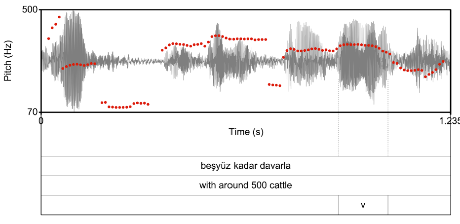

```{r setup, include=FALSE}
knitr::opts_chunk$set(echo = TRUE)
```

```{r echo=FALSE, warning=FALSE, message=FALSE}
library(knitr)

# library(tidyverse) # data manipulation
# options(dplyr.summarise.inform = FALSE)
# 
# library(magrittr) # pipes (%>% / %<>%)
# library(readr) # for read_csv(), read_delim()
# 
# library(cmdstanr) # R interface to Stan (mc-stan.org, for statistical modeling) [an alternative is 'rstan']
# library(brms) # lme4-like interface to Stan
# options(brms.backend = "cmdstanr")
# 
# library(ggplot2) # plotting
# library(plotly) # sharper plots in html
# theme_set(theme_bw() + theme(legend.position="top"))
# 
# library(posterior) # for dealing MCMC samples
# 
# # to-do: check later whether these are used
# library(bayesplot)
# library(tidybayes)
# library(brmstools)
# library(broom)

opts_chunk$set(cache=F) # , fig.retina = 1
```


```{r global_packages, echo=TRUE, results='hide', echo=FALSE}
library(tidyverse) # data manipulation
options(dplyr.summarise.inform = FALSE)

library(magrittr) # pipes (%>% / %<>%)
library(readr) # for read_csv(), read_delim()

#library(cmdstanr) # R interface to Stan (mc-stan.org, for statistical modeling) [an alternative is 'rstan']
library(brms) # lme4-like interface to Stan
#options(brms.backend = "cmdstanr")

library(ggplot2) # plotting
library(plotly) # sharper plots in html
theme_set(theme_bw() + theme(legend.position="top"))

library(rethinking)
```

```{r echo=FALSE}
df_amg <- readRDS("../data/data_mix.rds")
df_amg %<>% rename(dialect = dialectname)
df_amg %<>% rename(tau = troughFromVend)

df_amg %<>% ungroup() %>%
                dplyr::mutate( median_Turkish = median(tau [dialect=="Turkish"]),
                               median_Athenian = median(tau [dialect=="Athenian"]) )
df_amg %<>% dplyr::mutate( median_Turkish = ifelse(dialect=="Athenian", NA, median_Turkish),
                               median_Athenian = ifelse(dialect=="Turkish", NA, median_Athenian) )

color_AMG <- "gray"
color_turkey <- "#E30A17"
color_greece <- "#0D5EAF"

df_contr_dialect <- data.frame(dialect = c('Athenian', 'AMG', 'Turkish'),
                               cDialect_AMGmATH = c(-2/3,   1/3,  1/3),
                               cDialect_TRmAMG  = c(-1/3,  -1/3,  2/3)
                               )
df_amg %<>% left_join( df_contr_dialect , by = "dialect")

```

# Mixture Model | Background

- Baltazani, Przedlacka, Ünal, Logačev & Coleman (under review). Intonation of Greek in contact with Turkish: a corpus-based diachronic study.

- Speakers of Asia Minor Greek (AMG) was in close contact with Turkish until a two-way mass migration in the early 1920s.

- Still spoken by communities in Greece.

- How long do contact effects in intonation persist after contact has ceased?

- We extracted $f_0$ patterns from speech corpora for AMG, Greek, and Turkish and annotated $f_0$ shape curves.

---
# Mixture Model | Background

- Example $f_0$ contour for a Turkish sentence. (Octave errors were corrected.)

- We will focus on single parameter for this workshop, the *L tone alignment* $\tau$, which reflects the distance between the local minimum of the $f_0$ curve and the last stressed vowel in the utterance.

- $\tau$ tends to be $0$ in Athenian and *positive* in Turkish. 




---
# Mixture Model | Data

- Distribution of $\tau$ for each utterance by dialect and generation. Dotted lines indicate medians of the Turkish and Athenian distributions.

- The early AMG distributions looks quite bimodal, and appears to become more unimodal*-ish* with time.

- But the peaks aren't **quite** where they are supposed to be. 

- Can we quantify that intuition?


```{r echo=FALSE, warning=FALSE, message=FALSE}

  p <- df_amg %>% ggplot(aes(tau)) + geom_histogram(aes( y = ..density.., fill = dialect)) +
    scale_fill_manual(values = c(color_AMG, color_greece, color_turkey)) +
    geom_vline(aes(xintercept = median_Turkish), color = color_turkey, linetype = "dashed") +
    geom_vline(aes(xintercept = median_Athenian), color = color_greece, linetype = "dashed") +
    facet_grid(dialect ~ generation, scales = "free_y") +
    scale_y_continuous("percentage of observations", labels=scales::percent) +
    scale_x_continuous("L tone alignment (𝝉)") + 
    theme(strip.background =element_rect(fill="white")) 

p

```


---
# Mixture Model | Hypothesis

- AMG speakers' utterances are either Athenian-like or Turkish-like. 

- The mixture proportion changes from generation to genderation. 

- Not all mixtures look equally bimodal: Shapes of hypothetical mixture distibutions as a function of mixture proportion $\lambda$ and distance between component modes.


```{r echo=FALSE}

{
plot_mixture <- function(lambda, mu1, mu2, sigma1, sigma2)
{
    limts_scale = 3
    
    fn1 <- function(x) lambda*dnorm(x, mean = mu1, sd = sigma1)
    fn2 <- function(x) (1-lambda)*dnorm(x, mean = mu2, sd = sigma2)
    
    p <- ggplot()
    p <- p + stat_function(fun = function(x) fn1(x) + fn2(x))
    p <- p + stat_function(fun = function(x) fn1(x), linetype = "dashed") # , color = "darkgrey"
    p <- p + stat_function(fun = function(x) fn2(x), linetype = "dotted") #, color = "darkgrey"
    # limits <- c(mu1+limts_scale*c(1,-1)*sd1, mu2+limts_scale*c(1,-1)*sd2) %>% range()
    # p + scale_x_continuous(limits = limits) +
    p + ylab("probability density") + theme_bw() + scale_y_continuous(breaks=NULL)
}

p1 <- plot_mixture(lambda=.3, mu1=-4, mu2=0, sigma1=1, sigma2=1) + scale_x_continuous(limits = c(-8, 3), breaks=NULL) 
p2 <- plot_mixture(lambda=.5, mu1=-4, mu2=0, sigma1=1, sigma2=1) + scale_x_continuous(limits = c(-8, 3), breaks=NULL)
p3 <- plot_mixture(lambda=.7, mu1=-4, mu2=0, sigma1=1, sigma2=1) + scale_x_continuous(limits = c(-8, 3), breaks=NULL)

p4 <- plot_mixture(lambda=.3, mu1=-2.5, mu2=0, sigma1=1, sigma2=1) + scale_x_continuous(limits = c(-8, 3), breaks=NULL)
p5 <- plot_mixture(lambda=.5, mu1=-2.5, mu2=0, sigma1=1, sigma2=1) + scale_x_continuous(limits = c(-8, 3), breaks=NULL)
p6 <- plot_mixture(lambda=.7, mu1=-2.5, mu2=0, sigma1=1, sigma2=1) + scale_x_continuous(limits = c(-8, 3), breaks=NULL)

}

library(ggpubr)

strip_background <- theme(strip.background = element_rect(fill= "#d3d3d3"))

p <-
ggpubr::ggarrange(p1 + strip_background + facet_grid(~"lambda = 0.25"),
                  p2 + strip_background + facet_grid(~"lambda = 0.5"),
                  p3 + strip_background + facet_grid("distance = 4*SD"~"lambda = 0.75"), 
                  p4 + strip_background + facet_grid(~"lambda = 0.25"), 
                  p5 + strip_background + facet_grid(~"lambda = 0.5"), 
                  p6 + strip_background + facet_grid("distance = 2.5*SD"~"lambda = 0.75"), 
                  labels = LETTERS[1:6],
                  widths = rep(c(.8, .8, .9), 2))

print(p)

```


---
# Mixture Model | Model Specification

The simple part:

- Each Athenian utterance $i$ for speaker $s$ comes from a normal distribution. 

$$\tau_{s,i} \sim N(\mu_{A_s}, \sigma_{A})\text{, where }\mu_{A_s} = \mu_{A} + \Delta\mu_{s}$$


- Each Turkish utterance $i$ for speaker $s$ comes from a normal distribution.

$$\tau_{s,i} \sim N(\mu_{T_s}, \sigma_{T})\text{, where }\mu_{T_s} = \mu_{T} + \Delta\mu_{s}$$


---
# Mixture Model | Model Specification

The interesting part:

- Each speaker $s$ of AMG has a Turkish-like register and an Athenian-like register in AMG.

- Each AMG utterance $i$ for speaker $s$ comes from a mixture distribution:

$$z ~ \sim Bernoulli(\lambda_G)$$
$$y_{S}|z=0 \sim N(\mu_{T_S}, \sigma_{T})$$
$$y_{S}|z=1 \sim N(\mu_{A_S}, \sigma_{A})$$

- Each AMG speaker's deviation from the register average is the same for both registers 

$$\mu_{T_s} - \mu_{T} = \mu_{A_s} - \mu_{A} =  \Delta\mu_{s}$$

- The mixture weight $\lambda$ varies by generation: $\lambda_1$, $\lambda_2$, $\lambda_3$, $\lambda_4$.


---
# Mixture Model | Model Structure

- This specification requires a custom distribution for `brms` which we can define in Stan in three steps.
  1. Define a likelihood function.
  2. Declare it as a distribution.
  3. Use it in brms.


---
# Mixture Model | Model Code

```{r warning=FALSE, message=FALSE, size="small"}
stanvar_fn <- stanvar(block = "functions", scode = "
real shifted_gaussian_mixture_lpdf(real x, 
                                   real mu1, real mu2, 
                                   real sigma1, real sigma2, 
                                   real theta, real shift, 
                                   real group)
{
      real log_lik;
  
      if (group == -1) {
        log_lik = normal_lpdf(x|mu1, sigma1); //  # to-do: change
  
      } else if (group == 1) {
        log_lik = normal_lpdf(x|mu2, sigma2); //  # to-do: change
  
      } else if (group == 0) {
        log_lik = log_mix(inv_logit(theta),
                            normal_lpdf(x|mu1+shift, sigma1),
                            normal_lpdf(x|mu2+shift, sigma2)
                        );
  
      }
      
      return log_lik;
}")

```

---
# Mixture Model | Model Code

```{r warning=FALSE, message=FALSE, size="small"}
shifted_gaussian_mixture <- custom_family(
  name = "shifted_gaussian_mixture", 
  dpars = c("mu","muAlt", "sigma", "sigmaAlt", "lambda", "shift"),
  links = c("identity","identity", "log", "log", "logit", "identity"),
  lb = c(NA,NA,0,0,0,NA), 
  ub = c(NA,NA,NA,NA,1,NA),
  type = "real",
  vars = c("vreal1[n]")
)
shifted_gaussian_mixture$dpars <- c("mu", "mu2", "sigma1", "sigma2", "lambda", "shift")

```

---
# Mixture Model | Model Code

```{r warning=FALSE, message=FALSE, size="small"}


df_contr_generation <- data.frame(generation = c("generation 1", "generation 2", "generation 3", "generation 4"),
                                  cGen_2m1 = c(-3/4,  1/4,  1/4,  1/4),
                                  cGen_3m2 = c(-2/4, -2/4,  2/4,  2/4),
                                  cGen_4m3 = c(-1/4, -1/4, -1/4,  3/4))
df_amg %<>% left_join( df_contr_generation )
```

```{r warning=FALSE, message=FALSE, size="small"}


# set group ids for Athenian (-1), AMG (0), Turkish (1) to be used in the mixture analysis 
dialect_id <- data.frame(dialect = c('Athenian','AMG','Turkish'), dialect_id=c(-1, 0, 1))
df_amg %<>% left_join(dialect_id)

```


---
# Mixture Model | Model Code

```{r echo=FALSE, eval=T}
options(width = 150)
```

```{r warning=FALSE, message=FALSE, size="small"}

# set up the model formula
formula_mix <- bf( dv|vreal(dialect_id) ~ 1, 
                   mu2 ~ 1,
                   sigma1 ~ 1,
                   sigma2 ~ 1,
                   lambda ~ 1 + cGen_2m1 + cGen_3m2 + cGen_4m3, 
                   shift ~ 0 + (1|speaker)
                  )

```

---
# Mixture Model | Model Code

```{r warning=FALSE, message=FALSE, size="small"}

prior_mu = 'normal(0, 5)'
prior_sigma = 'normal(1, 5)'
prior_lambda = 'normal(0,2)'
prior_delta_lambda = 'normal(0,2)'

priors_mix <- c(
    set_prior(             class = 'Intercept', prior = prior_mu),
    set_prior(dpar = 'mu2', class = 'Intercept', prior = prior_mu),
    
    set_prior(dpar  = 'sigma1', class = 'Intercept', prior = prior_sigma),
    set_prior(dpar  = 'sigma2', class = 'Intercept', prior = prior_sigma),
    
    set_prior(dpar = 'lambda', class = 'Intercept', prior=prior_lambda),
    set_prior(dpar = 'lambda', class = 'b', prior=prior_delta_lambda)
)


```


---
# Mixture Model | Model Code

```{r warning=FALSE, message=FALSE, size="small"}

compute_loo <- function(fit) {
  if (is.null(fit$criteria$loo)) 
  {
      # brms::expose_functions(fit, vectorize = T)
      fit <- brms::add_criterion(fit, "loo")
  }
  fit
}


log_lik_shifted_gaussian_mixture <- function(i, prep)
{
  stopifnot(length(dim(prep$dpars$mu)) == 2)
  mu1 <- prep$dpars$mu[,i]
  
  if (length(dim(prep$dpars$mu2)) == 0) {
    mu2 <- prep$dpars$mu2
    
  } else if (length(dim(prep$dpars$mu2)) == 2) {
    mu2 <- prep$dpars$mu2[,i]
    
  } else {
    stop("prep$dpars$mu2: Invalid number of dimensions")
  }
  
  stopifnot(length(dim(prep$dpars$sigma1)) == 0)
  sigma1 <- prep$dpars$sigma1
  
  stopifnot(length(dim(prep$dpars$sigma2)) == 0)
  sigma2 <- prep$dpars$sigma2
  
  stopifnot(length(dim(prep$dpars$lambda)) == 2)
  lambda <- prep$dpars$lambda[,i]

  if (length(dim(prep$dpars$shift)) == 0) {
    shift <- prep$dpars$shift
    
  } else if (length(dim(prep$dpars$shift)) == 2) {
    shift <- prep$dpars$shift[,i]
    
  } else {
    stop("prep$dpars$shift: Invalid number of dimensions")
  }
  
  y <- prep$data$Y[i]
  group <- prep$data$vreal1[i]
  
  # shifted_gaussian_mixture_lpdf(y, mu1, mu2, sigma1, sigma2, lambda, shift, group)
  p_lambda <- plogis(lambda)
  
  log_lik <- ifelse(group == -1, 
                    dnorm(y, mean = mu1, sd = sigma1), # to-do: change
                    ifelse(group == 1,
                            dnorm(y, mean = mu2, sd = sigma2), # to-do: change
                            log_sum_exp( log(p_lambda) + dnorm(y, mean = mu1 + shift, sd = sigma1), log(1-p_lambda) + dnorm(y, mean = mu2 + shift, sd = sigma2) )
                          )
                   )
  log_lik
}

```


---
# Mixture Model | Model Code

```{r warning=FALSE, message=FALSE, size="small"}

cur_dv <- "tau"
cur_fname <- sprintf("../workspace/diachronic_mixture_%s", cur_dv)
cur_df_amg <- df_amg %>% rename(dv = !!cur_dv)

fit_mix <- brm(formula_mix,
               prior = priors_mix, 
               family = shifted_gaussian_mixture, 
               stanvars = stanvar_fn, 
               data = cur_df_amg, 
               iter = 2000, chains = 4, cores = 4, 
               file = cur_fname )


```


```{r warning=FALSE, message=FALSE, size="small"}
prior_summary(fit_mix)
```


---
# Mixture Model | Model Code

.tiny[
```{r warning=FALSE, message=FALSE, size="small"}
fit_mix
```
]

---
# Mixture Model | Model Code

```{r warning=FALSE, message=FALSE, fig.height=3}
 fit_mix %>%
      gather_draws(b_Intercept, b_mu2_Intercept) %>%
      ggplot(aes(.value, .variable)) + 
      stat_pointinterval(.width = c(0.66, 0.95)) +
      geom_vline(xintercept = 0, color="red",
             linetype = "dotted")

```


---
# Mixture Model | Model Code

```{r warning=FALSE, message=FALSE, fig.height=3}
 fit_mix %>%
      gather_draws(b_sigma1_Intercept, b_sigma2_Intercept) %>%
      ggplot(aes(.value, .variable)) + 
      stat_pointinterval(.width = c(0.66, 0.95))
```


---
# Mixture Model | Model Code

```{r warning=FALSE, message=FALSE, fig.height=3}
 fit_mix %>%
      gather_draws(b_lambda_Intercept, b_lambda_cGen_2m1, b_lambda_cGen_3m2, b_lambda_cGen_4m3) %>%
      ggplot(aes(.value, .variable)) + 
      stat_pointinterval(.width = c(0.66, 0.95))

```


---
# Mixture Model | Model Code

```{r warning=FALSE, message=FALSE}

samples_mix <- as_draws_df( fit_mix )

lambda_by_generation <- 
  sapply(1:nrow(df_contr_generation), function(i_row) {
    
    cur_samples <- with(samples_mix, with(df_contr_generation[i_row,], { 
      b_lambda_Intercept + cGen_2m1*b_lambda_cGen_2m1 + cGen_3m2*b_lambda_cGen_3m2 + cGen_4m3*b_lambda_cGen_4m3 
    }))
    
    credible_interval <- coda::HPDinterval(as.mcmc(cur_samples)) %>% c(median(cur_samples))
    names(credible_interval) <- c("lower", "upper", "median")
    
    plogis( credible_interval )

  })
lambda_by_generation %<>% t() %>% as.data.frame()
lambda_by_generation %<>% cbind( df_contr_generation, . )
lambda_by_generation$generation %<>% factor(., levels = rev(.))

  
```

---
# Mixture Model | Model Code

```{r warning=FALSE, message=FALSE, fig.height=3}


ggplot(lambda_by_generation, aes(median, generation)) + 
  geom_point() + geom_errorbarh(aes(xmin = lower, xmax = upper), height = .05) + 
  theme_bw() + ylab(NULL) + xlab("Estimate")

```
